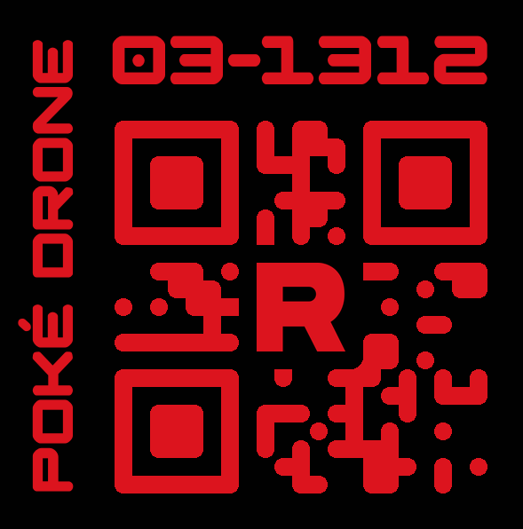

# Drone ID Maker

Python Library for creating drone IDs



## Install Dependancies

```bash
pip install -r requirements.txt
```

## Usage

```python
# import the class
from id_number import DroneTag

# Make a drone
drone_data = {
    "name": "Rory",
	"drone_id": "03-1312"
	"qr_data": "03-1312"
    "title": "Poké Drone",
    "front_color": "#DC141E",
	"back_color": "#000000",
	"id_size": 83,
	"title_size": 69,
    "logo": "./assets/logo.png",
	"logo_color": "#DC141E",
    "logo_size": 0.2,
    "logo_border": 0.2
	"border_radius": 0.125
}
drone_tag = DroneTag(drone_data)

# The only key needed is 'name' or 'drone_id', 
# name is used to generate a drone_id and the rest will use default values.
# More Examples in id_number.py

```

# Docs
### General
- `'front_color': HEX COLOR` Sets the color of the text and images. Default is white.
- `'back_color': HEX COLOR` Sets the color of the text and images. Default is black.
- `'qr_data': BYTES|STRING` Sets what data the QR code stores. 
This can be any bytes or string, and the QR code will change versions to fit the data.
If none is set then then the `drone_id` will be used.


### Text
- `'name': STRING`
	The name is hash to create a ID in the format of '00-0000'
- `'drone_id': STRING`
	Used to set the ID number and formatting, name is not needed if this is set
- `'id_size': INT`
	Overrides the ID number's size.
- `'title': STRING`
	Sets the drone's title on the side bar. If missing it will be omitted.
- `'title_size': INT`
	Overrides the title's size.

### Logo
- `'logo_color'` Overrides the logo's color, If missing the `front_color` will be used.
- `'logo_size'` Sets the logo's size. Default is `0.2`.
- `'logo_border'` Sets the logo's border thickness. Default is `0.2`.
- `'border_radius'` Sets the logo's border corner roundness. Default is `0.125`.
